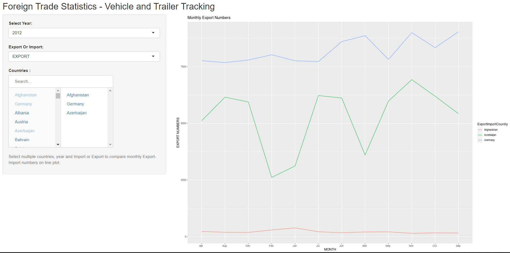

---
output:
  xaringan::moon_reader:
    lib_dir: libs
    nature:
      highlightStyle: github
      highlightLines: true
      countIncrementalSlides: false
      ratio: 16:9    
  html_document: default
---

```{r, echo =FALSE, eval = TRUE, warning=FALSE, message=FALSE}

library(readxl) ## for importing excel files
library(tidyverse) ## for manipulating df's
library(countrycode) ## for conversion of country codes
library(dplyr) ## for data manipulation
library(kableExtra) # Pretty print DataFrame
library(zoo) # Used for converting year month character to date data type
library(wordcloud2)

df_exportimport_final <- readRDS('ProjectData/ProcessedData/df_exportimport_final.rds')

```

class: center,middle
# Foreign Trade Statistics - Vehicle and Trailer Tracking

The Wall

2021.12.07
---
# Group Project

This presentation was prepared for group project of BDA 503-Essentials Data Analytics course.

Group Members;

- Anıl Okyol
- Kerem Yalçınkaya
- Kadir Baver Kerimoğlu 
---

# Dataset Information

Foreign Trade Statistics - Vehicle and Trailer Tracking dataset includes information on Export, Import and Empty Entry data of Turkish and Foreign Vehicles from 2012 to 2021 with total 72 countries. There are total 14 attributes.

You can find the whole report in [here.](https://pjournal.github.io/mef05g-the-wall/FinalProject/EDA_ForeignTradeStatistics.html)
---

# Objectives and Project Steps

In this group project we analyzed the import and export numbers based on different attributes.


Here is the steps we've taken,

- Downloading Data
- Transforming and Cleaning Data
- Exploratory Data Analysis
- Creating a functional Shiny App that shows Import/Export Information with multiple filters given by end user.

---
# Data

Dataset consists of 50112 observation and 14 attributes.

.left[
```{r, echo=FALSE, eval=TRUE, warning=FALSE, message=FALSE}
knitr::kable(str(df_exportimport_final), format = "html")
```
]

---
# Dataset Information


.pull-left[
Exporting is defined as the sale of products and services in foreign countries that are sourced or made in the home country. 

Importing is the flipside of exporting. Importing refers to buying goods and services from foreign sources and bringing them back into the home country.

Empty entry is vehicle without goods that entering the country.

]


.pull-right[
```{r, echo=FALSE, eval=TRUE, warning=FALSE, message=FALSE}

VehicleTypes <- unique(df_exportimport_final$VehicleType)
Explanation <- c("Turkish Vehicles (Export)", "Foreign vehicles (Export)", "Turkish vehicles (Import)","Foreign vehicles (Import)","Turkish vehicles (Empty Entry)","Foreign vehicles (Empty Entry)")

df_vehicle_explanation <- data.frame(VehicleTypes, Explanation)

knitr::kable(df_vehicle_explanation, format = "html")
```
]

---
# Most Imported Countries

.pull-left[

Most import countries as we can see in the right are EU countries such as Germany, Italy, France etc.

On the other hand countries close to our border like Iraq, Iran, Bulgaria etc.

]


.pull-right[
```{r, echo = FALSE, eval = TRUE, warning=FALSE, message=FALSE,error=FALSE,fig.height = 6, fig.width = 9}


#Import
ImportFreq <- df_exportimport_final %>% filter(ExportImport == 'IMPORT') %>% group_by(ExportImportCountry) %>% summarize(TotalImport = sum(Level)) %>% arrange(desc(TotalImport))

wordcloud2(data=ImportFreq, size=0.7)

```

]


---
# Most Exported Countries


.pull-left[

Most export countries as we can see in the right are countries close to our borders. 

Top countries are usually in middle east or Asia, followed by EU countries.


]


.pull-right[
```{r, echo = FALSE, eval = TRUE, warning=FALSE, message=FALSE,error=FALSE}


#Export
ExportFreq <- df_exportimport_final %>% filter(ExportImport == 'EXPORT') %>% group_by(ExportImportCountry) %>% summarize(TotalExport = sum(Level)) %>% arrange(desc(TotalExport))

wordcloud2(data=ExportFreq, size=1)

```

]

---
# Export-Import Trend

```{r , fig.width = 15,echo = FALSE, eval = TRUE, warning=FALSE, message=FALSE,error=FALSE}


df_exportimport_final %>% 
  filter(ExportImport == 'EXPORT' | ExportImport == 'IMPORT')  %>% 
  group_by(Date,ExportImport) %>% summarize(TotalExportImport = sum(Level)) %>%   
  ggplot( aes(x=Date, y=TotalExportImport, group=ExportImport, color=ExportImport)) +
  zoo::scale_x_yearqtr(n = 100,format = '%Y Q%q') +
  geom_line() + 
  theme(axis.text.x = element_text(angle = 90, vjust = 0.5, hjust=1)) +
  labs(title = "Import and Export numbers on Quarterly basis")
```

---
# Export-Import Numbers Based On Vehicle Type

.pull-left[
```{r, echo = FALSE, eval = TRUE, warning=FALSE, message=FALSE,error=FALSE}


#Import
ImportVehicles <- df_exportimport_final %>%  filter(ExportImport == 'IMPORT') %>% group_by(VehicleType) %>% summarize(TotalImport = sum(Level))
ggplot(ImportVehicles , aes(y=TotalImport, x=VehicleType)) + 
  geom_bar(position="dodge", stat="identity") + labs(title = "Import Numbers based on Vehicle Types")

```
]


.pull-right[
```{r, echo = FALSE, eval = TRUE, warning=FALSE, message=FALSE,error=FALSE}


# Export
ExportVehicles <- df_exportimport_final %>%  filter(ExportImport == 'EXPORT') %>% group_by(VehicleType) %>% summarize(TotalExport = sum(Level))
ggplot(ExportVehicles , aes(y=TotalExport, x=VehicleType)) + 
  geom_bar(position="dodge", stat="identity") + labs(title = "Export Numbers based on Vehicle Types")


```
]

---

# Export Numbers Based On Region Wise

```{r,fig.width = 15, echo = FALSE, eval = TRUE, warning=FALSE, message=FALSE,error=FALSE}


df_exportimport_final %>% 
  filter(ExportImport == 'EXPORT')  %>% 
  group_by(Date,ExportImportRegion) %>% summarize(TotalExport = sum(Level)) %>%   
  ggplot( aes(x=Date, y=TotalExport, group=ExportImportRegion, color=ExportImportRegion)) +
  zoo::scale_x_yearqtr(n = 100,format = '%Y Q%q') +
  geom_line() + 
  theme(axis.text.x = element_text(angle = 90, vjust = 0.5, hjust=1)) +
  labs(title = "Export numbers on Quarterly basis and Region Wise")


```

---

# Import Numbers Based On Region Wise

```{r,fig.width = 15, echo = FALSE, eval = TRUE, warning=FALSE, message=FALSE,error=FALSE}


df_exportimport_final %>% 
  filter(ExportImport == 'IMPORT')  %>% 
  group_by(Date,ExportImportRegion) %>% summarize(TotalExport = sum(Level)) %>%   
  ggplot( aes(x=Date, y=TotalExport, group=ExportImportRegion, color=ExportImportRegion)) +
  zoo::scale_x_yearqtr(n = 100,format = '%Y Q%q') +
  geom_line() + 
  theme(axis.text.x = element_text(angle = 90, vjust = 0.5, hjust=1)) +
  labs(title = "Import numbers on Quarterly basis and Region Wise")

```
---

# Shiny App


---

#Conclusion

1. Most imported countries are EU countries such as Germany, Italy, France etc. On the other hand countries close to our border like Iraq, Iran, Bulgaria etc.
2. Most exported countries are countries close to our borders. Top countries are usually in middle east or Asia, followed by EU countries.
3. There is parallel increase and decrease between Import and Export numbers on Quarterly basis. Moreover we found out drops on export and import numbers between fourth quarter and first quarter on every year. We strongly believe this is due to winter conditions also we found out a huge drop in between 2020-Q1 and 2020-Q2.We believe this is due to the Corona Virus.
4. Turkish vehicles mostly used for imports and exports.
5. Import levels in Europe are way greater than Asia and Africa regions. Africa has the lowest import numbers among all. When we analyze the line running by quarters, import lines are quite bumpy. This irregularity can be considered as a factor of seasonal and political changes. In Africa region the line runs steadily.


---

class: center,middle
Thank you for listening...